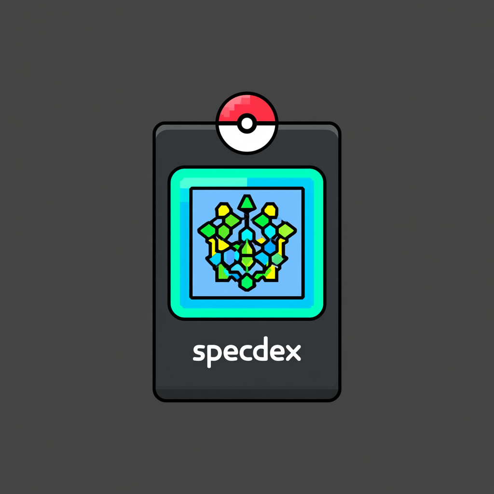

<!-- Logo goes here once generated — see "Logo" at the bottom.
     <p align="center"></p> -->

# specdex

**A Pokédex for your agent fleet.** specdex records what your autonomous AI coding runs are doing as a structured event stream, derives live state from it, and renders the whole fleet as living "minions" you can watch at a glance.

It is the observability + control layer for the [`/spec`](#the-spec-loop) autonomous-development loop: many specs running at once, each in its own worktree, each driven by a coder + reviewer — and one calm place to see which one needs you.

---

## Why

The `/spec` loop spins up dozens of concurrent runs. Their state used to live only as prose in `logbook.md` files — not machine-readable, no liveness, no fleet view. specdex fixes the substrate:

- **Event-sourced.** Every run appends to a per-spec `events.jsonl`; state is always *derived*, never hand-set.
- **Vendor-agnostic.** The core names no tool — not Slack, not Greptile, not a specific CI. It records generic facts (`gate --provider review`); *config* says which tool fills each role.
- **One source of truth.** The same typed event vocabulary drives the CLI, the desktop app, the notifications, and the audit trail.

## Components

| | What |
|---|---|
| **`dex`** (`crates/cli`) | the CLI — records events, reads config, streams the fleet |
| **`specdex-core`** (`crates/core`) | the event schema, registry scanner, state derivation, config/vault resolution |
| **specdex** (`apps/desktop`) | a [Tauri](https://tauri.app) desktop app rendering the live fleet of minions |

The registry lives at `~/.spec/<project>/<spec>/` — `events.jsonl` (source of truth) + a derived `state.json` (cheap per-spec snapshot).

## Install

```bash
cargo install --path crates/cli      # installs `dex`
cargo run -p specdex-desktop         # launches the desktop app
```

## Quickstart

```bash
export DEX_SPEC=my-project/my-feature   # the spec id (also the registry path)

dex init --branch spec/my-feature --worktree /path/to/worktree
dex phase build
dex agent spawn coder --id ag1
dex test --passed 42 --failed 0
dex phase review
dex review --round 1 --verdict pass
dex pr --number 4012 --url https://github.com/org/repo/pull/4012
dex phase verify
dex gate --provider ci --result success
dex phase complete

dex ls        # the fleet, with derived health
dex watch     # stream the fleet as JSON, live on every change
```

The CLI follows a git-style grammar: **one operation (record an event), state is derived.** The target spec is ambient via `DEX_SPEC` (or `-s <project>/<name>`).

### Lifecycle

Phases: `setup · plan · build · review · ship · verify · complete · accepted`.
`block "<reason>"` / `unblock` is a flag layered on the current phase, not a phase.

Derived health: `alive` · `idle` · `stale` (no heartbeat) · `needs-you` (blocked) · `done`.

## Configuration

specdex is config-driven and vendor-neutral. A project declares its integrations in a committed `.dex.toml`; a **vault** supplies shared defaults + identity across projects.

```toml
# .dex.toml — at the repo root
vault = "work"

[providers]
notifier  = "slack"          # slack | discord | none
ci        = "github-actions" # the CI provider
pr_review = "greptile"        # greptile | coderabbit | none  (reactor resolved from the registry)

[[ports]]                     # a project that runs services locally; a CLI declares none
service = "frontend"
base    = 5173
env     = "VITE_PORT"
```

```bash
dex config show          # merged effective config (defaults ← vault ← project)
dex config get providers.notifier
dex config validate      # typed validation; nonzero on any violation
dex config schema        # the machine-readable option space (for self-configuration)
dex ports alloc          # collision-aware port offset → `export` lines
```

Vaults live at `~/.config/dex/vaults/<name>.toml` and can set providers, `identity` (`env_file`, `github_org`), and `phases.skip` (e.g. a personal vault that skips `verify` — no CI/CD).

## The `/spec` loop

specdex is the substrate for the `/spec` skill (a separate agent skill, draft in `skill/`): plan → implement (coder, TDD) → review (reviewer) → ship → verify. The skill emits `dex` events at every milestone and reads `dex config` to dispatch to the configured notifier / CI / review provider — so the loop itself carries no hardcoded vendors.

## Architecture

A Cargo workspace, event-sourced end to end:

```
crates/core   event schema (the contract) · ~/.spec scanner · state derivation · config/vaults
crates/cli    `dex` — record events, config, ls/watch, ports alloc
apps/desktop  Tauri app — wraps core's fleet snapshot + a notify watcher → live webview
```

The event envelope is CloudEvents-flavored (`type`/`time`/`source`/`subject`/`data`); the `data` payload is the project's own typed vocabulary.

## Status

Early. The substrate, CLI, config/vaults, and a live desktop fleet view work. The `/spec` skill rewrite and the spec-detail screen (per-run timeline + agent view) are in progress.
